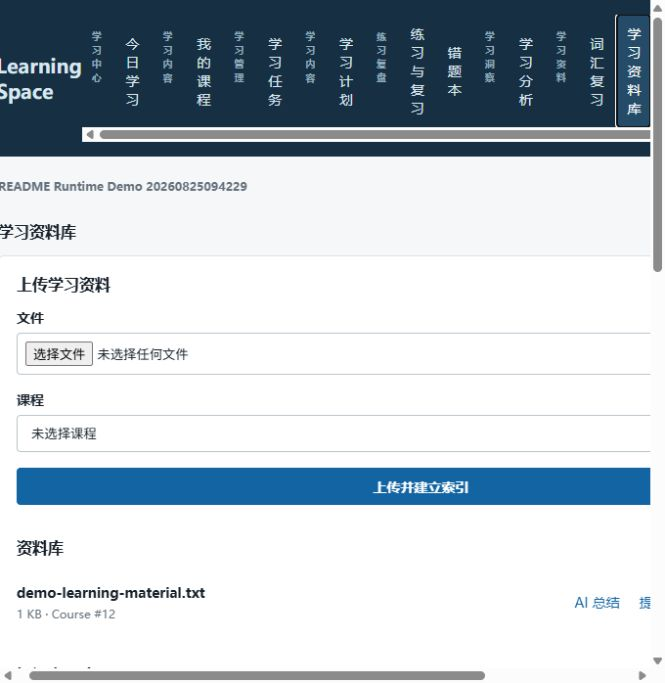
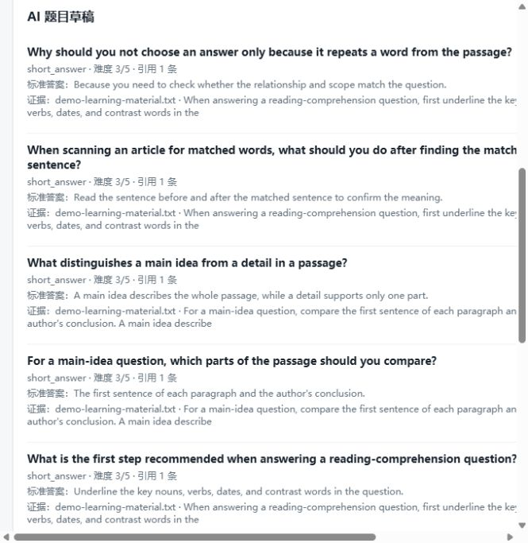

# Personalized Adaptive Learning Agent

这是一个面向个人学习记录的课程工作台，不是单纯的聊天机器人。它把课程、资料、计划、练习和复习结果放进同一个学习空间：资料进库以后才能用于检索和出题；每次练习都会留下作答记录；错题和知识点掌握情况会回到当天任务中。

项目包含两个入口：

- Web SaaS：适合多租户课程空间、资料入库和 Agent 工作流。
- Windows 桌面端：适合本地管理课程、题库、复习和备份。


## 从一门课开始

一次典型使用不会要求先配置一堆 AI 参数。注册并登录后，先新建课程和一个可量化的目标，例如“六周完成高数极限复习”。接着建立知识点和当天任务，上传讲义、笔记或可解析的资料。

资料会进入后台索引；索引完成后，可以用 RAG 查询资料证据，或者基于该证据生成练习题草稿。提交练习后，结果会更新错题、复习安排和知识点掌握度。用户可以在 Today 页面继续完成任务，或在分析页查看过程数据。

这条路径的关键约束是：题目生成依赖已索引的资料。资料不存在、不可解析或没有检索到证据时，系统会停在资料补充环节，而不是伪造一道“看起来合理”的题目。

## Web 界面实录

以下为本地运行时的真实页面，使用独立的演示账号和演示学习资料。图片用于说明已跑通的流程，不包含个人数据。

### 资料入库与证据检索

上传资料后，页面展示所属课程、文件与索引入口。索引完成的资料可作为 RAG 查询的证据来源。



### 有出处的练习题草稿

题目草稿会显示题型、难度、参考答案及所引用资料；用户可以在写入题库前审阅结果。



## 目前能做什么

### 学习空间

- 注册、登录、令牌刷新和退出登录
- 课程、学习目标、知识点、任务、提醒和课程笔记的增删改查
- Today 视图：开始、完成、跳过或调整任务，并跳转到课程和知识点
- 课程工作区：集中查看目标、资料、知识点、练习、错题、笔记和分析

### 资料与 RAG

- 上传文件和导入目录，保存至受管控的工作区
- SHA-256 去重、预览、重命名、回收站和恢复
- 后台解析、索引、任务状态和日志查看
- 基于已索引资料的证据检索；网页来源会先尝试发现可导入 PDF

### 练习与复习

- 本地题库 CRUD、JSON 导入导出和随机练习
- 单选、多选和简答题；多选作答会规范化后判分
- 作答耗时、正确性、会话汇总和错题自动收集
- 1 / 3 / 7 / 14 / 30 天的间隔复习安排及状态历史

### Agent 与管理

- 学习计划、资料检索、题目生成和学习报告的后台任务
- 需确认的写入操作、工具权限、审计日志和 Agent 记忆
- 学习统计、全量时间范围分析、CSV 导出和受管控备份

## 本地运行 Web SaaS

要求：Docker Compose v2，且 Docker 引擎可用。

```powershell
Copy-Item .env.example .env
docker compose -f docker-compose.saas.yml up -d --build
docker compose -f docker-compose.saas.yml run --rm migrate python -m alembic current
```

访问 <http://127.0.0.1:8000/web/>，注册一个测试账号后登录。

下面的烟雾测试会创建独立组织和课程，并实际覆盖登录、课程/目标/任务、知识点、作答与错题、多选判分、资料上传、RAG、AI 任务、Agent、笔记与分析接口。仅应在本地或隔离的测试环境运行：

```powershell
.\.venv\Scripts\python.exe scripts/smoke_test_saas.py --base-url http://127.0.0.1:8000
```

## 桌面端

```powershell
python -m venv .venv
.\.venv\Scripts\python.exe -m pip install -e ".[dev]"
.\.venv\Scripts\python.exe -m app.main
```

默认数据目录位于用户目录下的 `.personal_learning_desktop`，可通过 `LEARNING_DATA_DIR` 修改。桌面端的资料、数据库、日志和备份与程序安装目录分开，升级或卸载不会自动清除学习数据。

## 测试、构建与发布

```powershell
.\.venv\Scripts\python.exe -m pytest -p no:cacheprovider
python scripts/build_windows.py
python scripts/smoke_test_release.py app\PersonalLearningDesktop\PersonalLearningDesktop.exe
```

生产部署必须使用真实密钥、HTTPS、独立 PostgreSQL/Redis/对象存储，并执行安全检查和 SaaS 烟雾测试。具体步骤见 [生产发布手册](docs/PRODUCTION_RELEASE.md)。

## 边界

- RAG 和 AI 出题依赖资料解析、索引和可用的模型配置；它们不是默认离线能力。
- 公开生产环境默认关闭 Web Coding Agent，不会向 API 容器挂载主机 Docker socket。
- 桌面端与 Web 端属于不同运行模式；通过受保护的伴侣 API 连接，而不是共享本地 SQLite 文件。

项目分层、线程模型与本地数据安全设计见 [ARCHITECTURE.md](ARCHITECTURE.md)。
