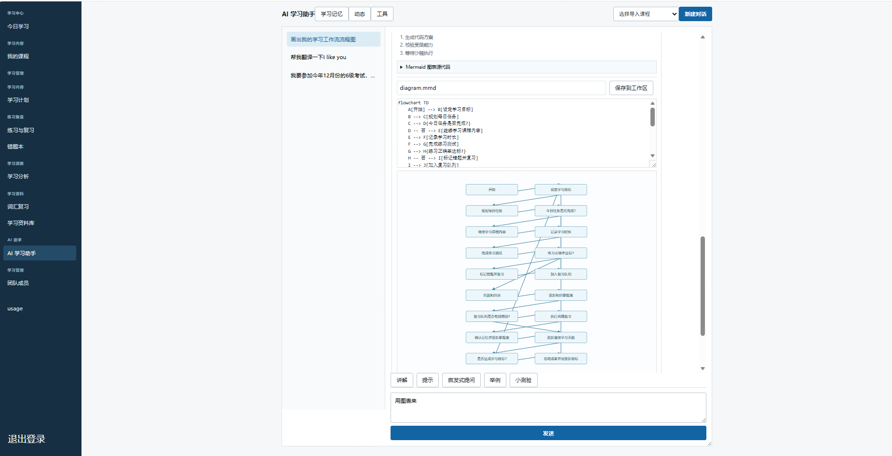
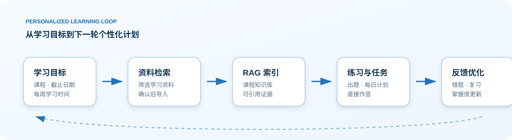
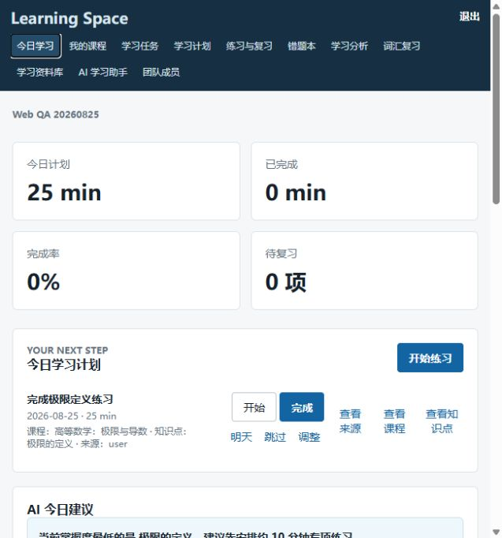
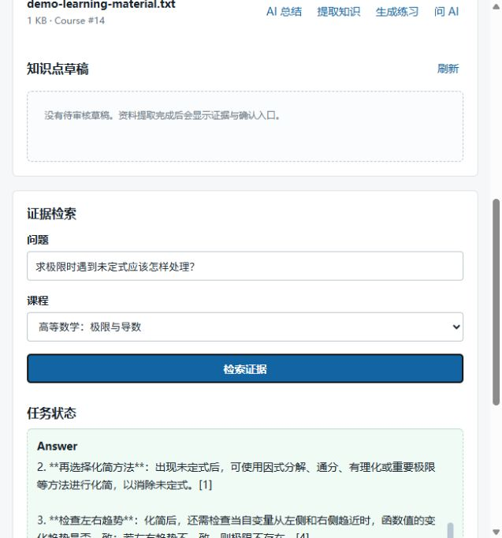
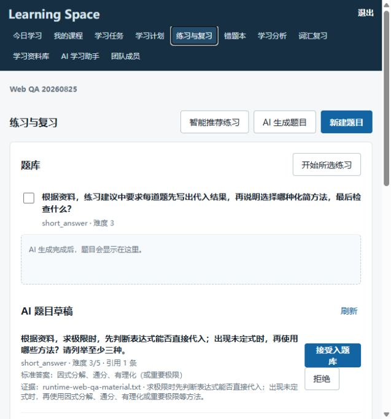
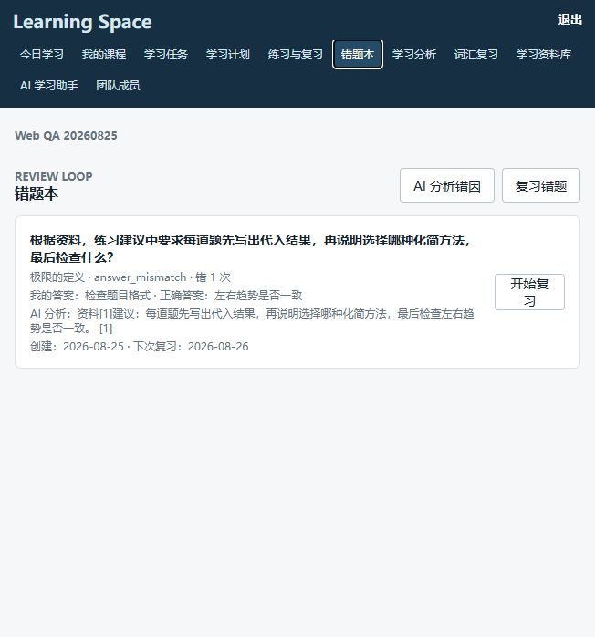

# Personalized Adaptive Learning Agent

## AI Learning Assistant Overview

This project is an AI learning assistant built around a continuous learning loop, rather than a simple chat interface. It connects goals, plans, learning resources, practice, review, and learner data through both Web SaaS and Windows desktop clients.

### Learning Loop and Multi-Agent Workflows

The assistant can turn a natural-language learning request into a stateful workflow:

1. Analyze the goal, deadline, selected course, current mastery, and available study time.
2. Create a staged plan and daily tasks.
3. Search public sources, identify downloadable learning files, and import them into the course resource library.
4. Parse and index resources, then retrieve grounded evidence with RAG.
5. Generate practice based on indexed material, grade submissions, and retain mistakes.
6. Update per-knowledge-point mastery and the spaced-review queue from every result.
7. Route unmastered content back to supplemental learning and targeted practice; move mastered content forward and adjust the plan over multiple study rounds.

The workflow is coordinated as a LangGraph-style stateful adaptive learning graph. Research, planning, question generation, diagnosis, and review nodes cooperate while course creation, plan writes, and imports retain confirmation and audit boundaries.

### AI Assistant Features

- Conversational tutoring: explanations, examples, hints, Socratic questions, and quick quizzes.
- Web search and resource import: search public sources, download importable PDF/text resources, and create background indexing jobs. Reference-only pages are reported clearly instead of being falsely marked as imported.
- Restricted Web Coding Agent: generate temporary proposals for computation, analysis, and diagrams. Code runs only after confirmation in a no-network, read-only sandbox.
- In-chat visualization: Mermaid flowcharts, relationship diagrams, and learning paths are rendered as safe inline SVG images in the chat.
- Vocabulary, practice, and review: vocabulary review, question banks, answer records, mastery analytics, and 1/3/7/14/30-day spaced review.
- Administrator observability: administrators can review model token consumption by user and tenant.

### Trust and Safety

- Question generation is grounded in indexed course resources and retrieval evidence. When evidence is insufficient, the assistant asks for material instead of inventing sources.
- Web download, resource import, code execution, and workspace writes are bounded by permissions, confirmations, or a sandbox.
- Tenant data is organization-isolated and consequential writes are auditable.

## Complex Agent Task Screenshots

The following screenshot is from the running Web client. A single request asking the assistant to draw the learning workflow is turned into a multi-step Coding Agent task: it generates and validates a Mermaid proposal, exposes the editable source, renders the workflow in the chat, and keeps normal tutoring actions available below the result.



The same Agent workspace supports a research-oriented flow: search public sources, rank candidate learning materials, inspect a selected page, import a directly downloadable PDF/text resource, wait for background parsing and indexing, and then use the indexed evidence for question generation. Pages that are only catalogues or cannot provide an importable file remain references instead of being reported as successful imports.

Typical complex task examples:

- “Prepare a CET-6 study plan, search for reliable materials, import the available PDFs, and generate the first diagnostic exercise.”
- “Draw my adaptive learning workflow, show the Mermaid result in the chat, and revise the diagram after I change the wording.”
- “Search the selected source, compare the evidence, create a course task, grade my answers, and route weak knowledge points back to supplemental practice.”

这是一个面向个人学习记录的课程工作台，不是单纯的聊天机器人。它把课程、资料、计划、练习和复习结果放进同一个学习空间：资料进库以后才能用于检索和出题；每次练习都会留下作答记录；错题和知识点掌握情况会回到当天任务中。

项目包含两个入口：

- Web SaaS：适合多租户课程空间、资料入库和 Agent 工作流。
- Windows 桌面端：适合本地管理课程、题库、复习和备份。



## 从一门课开始

一次典型使用不会要求先配置一堆 AI 参数。注册并登录后，先新建课程和一个可量化的目标，例如“六周完成高数极限复习”。接着建立知识点和当天任务，上传讲义、笔记或可解析的资料。

资料会进入后台索引；索引完成后，可以用 RAG 查询资料证据，或者基于该证据生成练习题草稿。提交练习后，结果会更新错题、复习安排和知识点掌握度。用户可以在 Today 页面继续完成任务，或在分析页查看过程数据。

这条路径的关键约束是：题目生成依赖已索引的资料。资料不存在、不可解析或没有检索到证据时，系统会停在资料补充环节，而不是伪造一道“看起来合理”的题目。

## Web 界面实录

以下为本地运行时的真实页面，使用独立的演示账号、课程和资料。图片来自本仓库当前版本的网页登录验收，不包含个人学习数据。

本轮验收实际走完：注册登录、创建课程/知识点/目标/当天任务、资料上传和离线索引、RAG 证据检索、基于引用的题目草稿生成与审核、作答、错题入库及下次复习安排。

### 今日任务与学习建议

任务、知识点、目标和错误作答会回流到 Today，给出下一步学习建议。



### 资料入库与证据检索

上传资料后，页面展示所属课程、文件与索引入口。索引完成的资料可作为 RAG 查询的证据来源。



### 有出处的练习题草稿

题目草稿会显示题型、难度、参考答案及所引用资料；用户可以在写入题库前审阅结果。



### 错题与复习安排

错误作答会记录用户答案、标准答案、引用说明和下一次复习日期。



## 目前能做什么

### 学习空间

- 注册、登录、令牌刷新和退出登录
- 课程、学习目标、知识点、任务、提醒和课程笔记的增删改查
- Today 视图：开始、完成、跳过或调整任务，并跳转到课程和知识点
- 课程工作区：集中查看目标、资料、知识点、练习、错题、笔记和分析

### 资料与 RAG

- 上传文件和导入目录，保存至受管控的工作区
- SHA-256 去重、预览、重命名、回收站和恢复
- 后台解析、索引、任务状态和日志查看
- 基于已索引资料的证据检索；网页来源会先尝试发现可导入 PDF

### 练习与复习

- 本地题库 CRUD、JSON 导入导出和随机练习
- 单选、多选和简答题；多选作答会规范化后判分
- 作答耗时、正确性、会话汇总和错题自动收集
- 1 / 3 / 7 / 14 / 30 天的间隔复习安排及状态历史

### Agent 与管理

- 学习计划、资料检索、题目生成和学习报告的后台任务
- 需确认的写入操作、工具权限、审计日志和 Agent 记忆
- 学习统计、全量时间范围分析、CSV 导出和受管控备份

## 本地运行 Web SaaS

要求：Docker Compose v2，且 Docker 引擎可用。

```powershell
Copy-Item .env.example .env
docker compose -f docker-compose.saas.yml up -d --build
docker compose -f docker-compose.saas.yml run --rm migrate python -m alembic current
```

访问 <http://127.0.0.1:8000/web/>，注册一个测试账号后登录。

下面的烟雾测试会创建独立组织和课程，并实际覆盖登录、课程/目标/任务、知识点、作答与错题、多选判分、资料上传、RAG、AI 任务、Agent、笔记与分析接口。仅应在本地或隔离的测试环境运行：

```powershell
.\.venv\Scripts\python.exe scripts/smoke_test_saas.py --base-url http://127.0.0.1:8000
```

## 桌面端

```powershell
python -m venv .venv
.\.venv\Scripts\python.exe -m pip install -e ".[dev]"
.\.venv\Scripts\python.exe -m app.main
```

默认数据目录位于用户目录下的 `.personal_learning_desktop`，可通过 `LEARNING_DATA_DIR` 修改。桌面端的资料、数据库、日志和备份与程序安装目录分开，升级或卸载不会自动清除学习数据。

## 测试、构建与发布

```powershell
.\.venv\Scripts\python.exe -m pytest -p no:cacheprovider
python scripts/build_windows.py
python scripts/smoke_test_release.py app\PersonalLearningDesktop\PersonalLearningDesktop.exe
```

生产部署必须使用真实密钥、HTTPS、独立 PostgreSQL/Redis/对象存储，并执行安全检查和 SaaS 烟雾测试。具体步骤见 [生产发布手册](docs/PRODUCTION_RELEASE.md)。

## 边界

- RAG 和 AI 出题依赖资料解析、索引和可用的模型配置；它们不是默认离线能力。
- 公开生产环境默认关闭 Web Coding Agent，不会向 API 容器挂载主机 Docker socket。
- 桌面端与 Web 端属于不同运行模式；通过受保护的伴侣 API 连接，而不是共享本地 SQLite 文件。

项目分层、线程模型与本地数据安全设计见 [ARCHITECTURE.md](ARCHITECTURE.md)。
